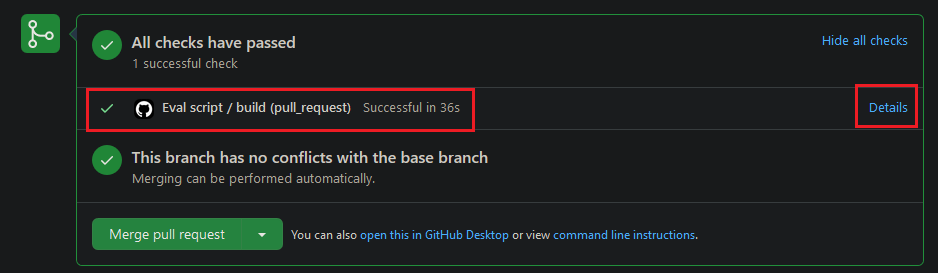

# GLUECoS: An Evaluation Benchmark for Code-Switched NLP
**NEW (Jun - 2021): Evaluation for Code-Mixed Machine Translation task has been enabled. Please check [this](#evaluation) section**

**NEW (Mar - 2021): We have added a new Code-Mixed Machine Translation Dataset to GLUECoS. Please check [this](#code-mixed-machine-translation-task) section**

**NEW (Oct - 2020): Please check our updated policy about making submissions for evaluation [here](#submission-policy)**

**NEW (Sep - 2020): NLI dataset preprocess script updated to fix repetitions in data. If you have downloaded the datasets before, please check [this](#nli-preprocess-script-update) section**

**NEW (Aug - 2020): Evaluation is now automated and results are presented instantly. Please check [this](#submitting-predictions-for-evaluation) section**

This is the repo for the ACL 2020 paper [GLUECoS: An Evaluation Benchmark for Code-Switched NLP](https://www.aclweb.org/anthology/2020.acl-main.329/)

GLUECoS is a benchmark comprising of multiple code-mixed tasks across 2 language pairs (En-Es and En-Hi)

Recording of talk given at ACL: [Link](https://slideslive.com/38928983)

Below are instructions for obtaining the datasets that comprise the benchmark and training transformer based models on this data. Both steps can be run on separate systems and the instructions are structured in such a way. All the user has to do is to copy over the `Data/Processed_Data` folder over to perform training

## Obtaining Datasets
Follow the following instructions to download and process the datasets. All the steps should work in a brand new conda environment with `python==3.6.10` or a docker container with the `python:3.6` image. Please note that the splits for some of the datasets are different from their original releases.
1. Install the requirements for the preprocessing scripts
    ```
    pip install -r requirements.txt
    ```
2. Create a twitter developer account and fill in the 4 keys, one per line,  in `twitter_authentication.txt`. The file should look like this
    ```
    consumer_key
    secret_key
    access_token
    access_secret_token
    ```
    
3. A transliterator is used to transliterate roman parts of the dataset to devanagari. Currently, we support 2 options: indic-trans or Microsoft Translator. If you'd like to use indic-trans, you'll have to install the package from [here](https://github.com/libindic/indic-trans). If you'd like to use Microsoft Translator, you will need to obtain a key for it. Instructions for obtaining this key can be found [here](https://docs.microsoft.com/en-us/azure/cognitive-services/translator/translator-how-to-signup). While creating the translator instance, please set the region to global. The number of queries made fall within the free tier. This key will be referred to as SUBSCRIPTION_KEY in the next step
4. To download the data, run the command below. This will download the original datasets, perform all the preprocessing needed and bring them into a format that the training scripts can use
    ```
    # If you're using indic-trans, make sure it's package is installed and run it in the following way
    ./download_data.sh

    # If you're using Microsoft Translator, run it in the following way, passing the key and run it in this way
    ./download_data.sh SUBSCRIPTION_KEY
    ```
    The dowloaded and processed data is stored in `Data/Processed_Data`. 
    
    Some of the datasets did not have predefined splits, so the splits used for those can be found in `Data/Original_Data`.

    Please note that the labels for the test sets are not the gold labels. They have been assigned a separate token to maintain fairness in the benchmarking.

    This will not download/preprocess the QA dataset. For that, please check the next step

5. The original QA dataset (Chandu et. al, 2018) contains contexts only for some examples. To obtain contexts for the rest, [DrQA](https://github.com/facebookresearch/DrQA) is used to obtain contexts from a Wikipedia dump. To run this, you will need atleast 20GB of disk storage (to store the wikidump) and 16GB+ of RAM (to run DrQA). DrQA uses PyTorch, so having a GPU will help speed it up (although it isn't necessary).

    The following steps MUST be run with a `python:3.6.10` container. Start up a container with this image and clone the repo into it.

    First, open `download_data.sh` and comment out all lines starting from 413 (get_transliterations) till the end. After this, uncomment line 419 alone (download_qa_en_hi).

    Next, run this to download the partial version of the QA dataset
    ```
    bash download_data.sh
    ```
    Next, run the following command to download the DrQA and run it on the sentences with missing contexts
    ```
    bash Data/Preprocess_Scripts/preprocess_qa.sh
    ```
    If DrQA ran properly, the penultimate line of the above script should say `Finished. Total = 215`. If the number displayed in this line is different, then DrQA has not run properly. Please make sure you're using the latest version of this repo and running it inside a container with the `python:3.6.10` image.

    The processed QA dataset will be at `Data/Processed_Data/QA_EN_HI`. You can take these files and store them along with the other datasets.

### NLI Preprocess Script Update
The data downloading and preprocessing scripts were updated in Sep - 2020 to fix an issue with the creation of the NLI train and test sets. Running the scripts as is will download all the datasets, so you do not have to make any changes if you're doing it for the first time. If you downloaded the datasets before this fix was added, you can follow these steps to get the updated NLI data alone.  
1. Make sure you have the latest version of the repo
2. Comment out lines 390-397 and 399-401 of `download_data.sh`
3. Run the updated `download_data.sh` to create the new NLI dataset alone

## Training models on the data
The code contains 4 different evaluation scripts
1. One script for token level tasks:
    - LID (en_es/en_hi)
    - NER (en_es/en_hi),
    - POS (en_es/en_hi_fg/en_hi_ud)
2. One script for the sentence level tasks:
    - Sentiment (en_es/en_hi)
3. One script for the QA task 
    - QA (en_hi)
4. One script for the NLI task
    - NLI (en_hi)

You can train the models on your system or via Azure Machine Learning. To know more about the latter, please refer to [this README](azure_ml/README.md).

### Install the training requirements  
Note: The requirements for dataset preprocessing and training have been separately mentioned, as you may run them on different systems
1. Install a suitable version of pytorch for your system, `pip install torch` should work in most cases
2. The requirements from the file in `Code/requirements.txt`
    ```
    pip install -r Code/requirements.txt
    ```
### Training
Run the below command to fine-tune your model on any of the task. The training scripts uses the Huggingface library and support any models based on BERT, XLM, XLM-Roberta and similar models.

```
bash train.sh MODEL MODEL_TYPE TASK 
```
Example Usage :
```    
bash train.sh bert-base-multilingual-cased bert POS_EN_HI_FG
```
You can also run fine-tuning for all tasks with the following command :
```
bash train.sh bert-base-multilingual-cased bert ALL
```

## Submitting Predictions for Evaluation
Submission is done by uploading the results to a fork of this repo and making a pull request to the main repo. The evaluation is done automatically by a set of actions that run for the PR.

The training scripts supplied write predictions for the test set into the `Results` folder.
1. Zip this folder into results.zip with `zip results.zip -r Results`.
2. Create a fork of `microsoft/GLUECoS` on Github.
3. Add this `results.zip` file to the root directory of your fork and make a pull request to the main repo.

A set of actions will run for your pull request. Clicking on "Show all checks" will reveal that one of these is named "Eval script". Clicking on "Details" will take you to the sequence of steps run for the action. Expanding the "Run Eval" stage will show you the results of the eval script.
<p float="left">
  
   
</p>

If you would like to make another submission, you can update the same PR with the new `results.zip` file and the action will run again. You DO NOT need to open a new PR each time. Please wait till the current action finishes running before updating the PR with the new submission.

Please ensure that this is the exact structure of the zip file. The eval script will fail if there are any differences in the names or the structure
```
results.zip
    └── Results
        ├── NLI_EN_HI
        │   └── test_predictions.txt
        ├── QA_EN_HI
        │   └── predictions.json
        .
        .
        .
        └── Sentiment_EN_HI
            └── test_predictions.txt

```
<p id="submission-policy">
You can make as many submissions as you want. Beyond the 5th submission, your best score will be added to the leaderboard. We will use your Github username for the leaderboard. Instead, if you would like your group's name/affilication to appear on the leaderboard, please mention this along with details about the model in the pull request.
</p>

## Code-Mixed Machine Translation Task
We have added a code-mixed machine translation dataset to GLUECoS. The dataset and task are for translation from English to Hindi-English. The dataset has been provided by Prof. Alan Black's group from CMU. Since BERT like models aren't suitable for this task, we offer this as a separate part of the benchmark with a separate leaderboard. The baseline method for this task is mBART finetuned on this dataset.

### Obtaining the dataset
The `download_data.sh` script does the downloading and preprocessing of this dataset, but the MT dataset part is disabled by deafult. To enable this, you'll have to comment out lines 409-420 and uncomment line 421, and then run the script just like before.

### Train Scripts
We have supplied training scripts that can be used to finetune mBART or related models on the dataset. The train script is at `Code/run_seq2seq.py`. You can run that script directly, or alternatively start training this way
```
bash train.sh facebook/mbart-large-cc25 mbart MT_EN_HI
```
You can have a look at the training arguments in `Code/train_mt.sh` and modify them as per your needs. You might need to adjust batch size depending on the GPU that you are using.

### Evaluation
The train scripts write the predictions on the test set to the `Results` directory and you can submit these for evaluation similar to how you do for the other tasks. The predictions are written to `Results/MT_EN_HI/translations.txt`. The zip file that gets uploaded is expected to follow this structure
```
results.zip
    └── Results
        └── MT_EN_HI
            └── translations.txt
```
The MT task will have a leaderboard that is separate from the other tasks. The evaluation for the MT task has been enabled now.

## Citation
Please use the following citation if you use this benchmark:
```
@inproceedings{khanuja-etal-2020-gluecos,
    title = "{GLUEC}o{S}: An Evaluation Benchmark for Code-Switched {NLP}",
    author = "Khanuja, Simran  and
      Dandapat, Sandipan  and
      Srinivasan, Anirudh  and
      Sitaram, Sunayana  and
      Choudhury, Monojit",
    booktitle = "Proceedings of the 58th Annual Meeting of the Association for Computational Linguistics",
    month = jul,
    year = "2020",
    address = "Online",
    publisher = "Association for Computational Linguistics",
    url = "https://www.aclweb.org/anthology/2020.acl-main.329",
    pages = "3575--3585"
}
```

# Contributing

This project welcomes contributions and suggestions.  Most contributions require you to agree to a
Contributor License Agreement (CLA) declaring that you have the right to, and actually do, grant us
the rights to use your contribution. For details, visit https://cla.opensource.microsoft.com.

When you submit a pull request, a CLA bot will automatically determine whether you need to provide
a CLA and decorate the PR appropriately (e.g., status check, comment). Simply follow the instructions
provided by the bot. You will only need to do this once across all repos using our CLA.

This project has adopted the [Microsoft Open Source Code of Conduct](https://opensource.microsoft.com/codeofconduct/).
For more information see the [Code of Conduct FAQ](https://opensource.microsoft.com/codeofconduct/faq/) or
contact [opencode@microsoft.com](mailto:opencode@microsoft.com) with any additional questions or comments.
